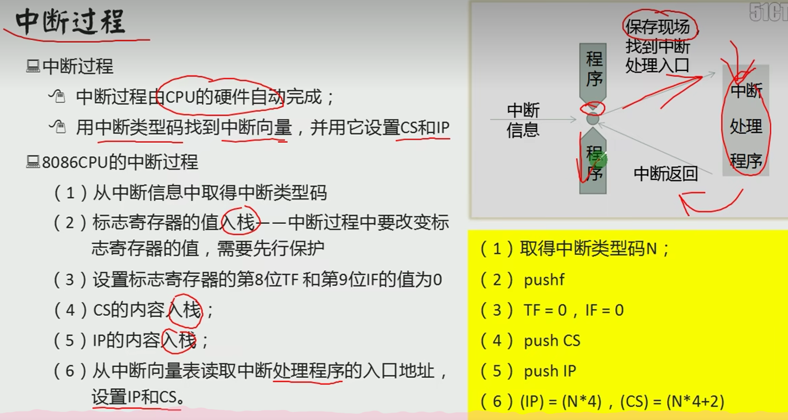

-d + address ：列出预设地址内存处的128个字节的内容
-r + 寄存器，可以改变寄存器的值,e.g. -rcs (中间要按回车)1234 , -rip 1513

-e address + data：写入寄存器数据,相当于mov ax:xxxx 并执行t

-u : 查看数据（查看的是CS:IP处的
-a : 写入汇编指令:
	-a也就是在CS:IP 的位置写入汇编指令

-t : 执行CS:IP的指令，每执行一次IP就会+=(指令所占用的地址长度)

##指令内容：
jup: 改变cs/ip
jmp 端地址  ：偏移地址
仅修改IP：jmp bx

/* 段地址可以表示在DS里， ___, [xxx] 表示地址 ds:xxx --> ___
不能 mov ds,1000H //与硬件有关
要写成 mov bx,1000
	    mov ds,bx */

栈: 
SS:存放栈顶偏移地址
SP:存放栈顶偏移地址
SS:SP指向栈顶元素  

-------------------------------------------------------------------------------
	.asm-->.obj-->.exe
	     masm    link

assume cs:code,ds:data,ss:stack
data segment 
	dw 1234H ...
data  ends

stack segment
	dw 0,0,...
stack ends

code segment
start:mov ax,stack
	 mov ss,ax
	 mov sp,xx
	 mov ax,data
	 mov ds,ax
//初始化，cs是不需要初始化的，程序能够识别到code segment

mov ax,4c00h
int 21h

code ends 
end start
--------------------------------------------------------------------------------
cx用于loop中循环次数  ；判断条件为cx == 0，每次循环cx -= 1
段前缀ds:[bx]		es:[bx] ;可以用于辅助需要频繁更改DS
inc bx ==> bx++

dw:define word
db:define byte
dd:define double byte	
可以用cs:[bx] 来存放一些临时数据，不需要将这些数据加到某一些地址的寄存器中防止崩塌			cs:[ ]中前面存储d_的数据，后面才是代码段
用start:     end start跳过d_的数据，让ip指向代码段第一个地址(也就是start处

---------------------------------------------------------------------------------
寄存器：
通用：ax  bx(base)//寻址或当通用	cx(用于判断loop  dx
变址：si(source index  di(destination index
指针：sp(stack pointer)   bp(base pointer)
指令指针：ip(instrucment pointer)
段：cs(code segment) ss(stack segment) ds(data segment) es(extra segment)
标志：psw

寻址组合 bx+si	bx+di	
               bp+si	bp+di
或者后面加任意的idata

bx默认ds段	bp默认ss段 	若指定端则不是默认
word ptr/byte ptr指明地址操作是针对字的还是字节的//没有指明的话要看被操作寄存器是_x还是_l/_h

jcxz:		(cx)=0则转移到标号

---

## 中断:

中断:/* 由硬件完成 */
内中断（内/软):	除法0/溢出/int n/into
外	  :硬件方面
CPU(接收中断信息) --> 改变CS:IP//(N*4+2):(N*4);

中断向量表(得到中断号 --> 查到中断程序入口地址

