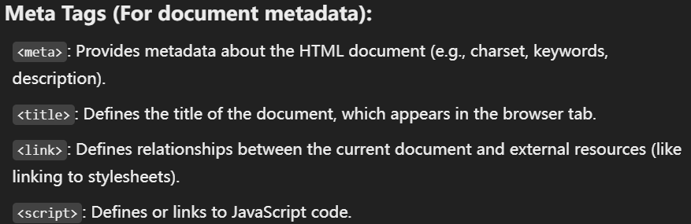
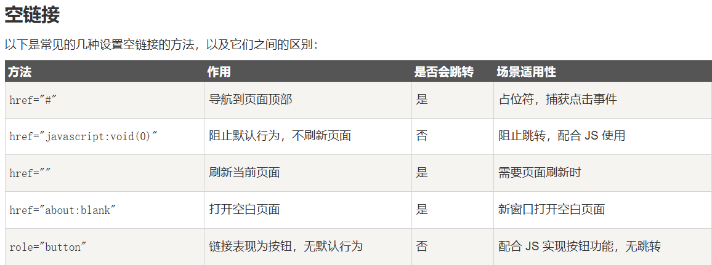

REFERENCE:
https://developer.mozilla.org/en-US/
https://htmlcheatsheet.com/
summarized tags:





hypertext markup language
cascading style sheets

head:
```html
<!--Internal Stylesheet 直接在<head>中声明-->
<head>
<style type="text/css">
body {background-color:yellow;}
p {color:blue;}
</style>
</head>
```

```html
<!--External Stylesheet 在别的mystyle.css通过hyper reference连接-->
<head>
<link rel="stylesheet" type="text/css" href="mystyle.css">
</head>
```


meta 
-> 
<meta name="keywords" content="HTML, CSS, XML, XHTML, JavaScript">
<meta name="description" content="note">
<meta name="author" content="ctrau">
<meta http-equiv="refresh" content="30"> etc

base -> <base> 标签描述了基本的链接地址/链接目标,该标签作为HTML文档中所有的链接标签的默认链接 ->  作为body中<a href = "sss"></a> href的默认内容
link -> 文档链接外部资源(样式表等)
title -> name
style -> 标签定义了HTML文档的样式文件引用地址/直接添加样式


```
<head>
    <meta charset = "utf-8">
    <title>this is title</title>
    <style type = "text/css">
    body{
        background-color:blue;
    }
    p{
        color:green
    }
    </style>
</head>
```


Hyper Reference:
<a></a>包含的属性
1. href
2. target(打开连接的方式)
    a. target = "_blank":新 窗口/页面标签
    b. target = "_self":当前 窗口/页面标签(default)
    c. target = "_parent":父框架
    d. target = "_top":整个窗口，取消框架
3.  rel(relation - 链接与目标页面的关系)
    a. rel = "noopenner":   防止新的浏览上下文（页面）访问window.opener属性和open方法
    b. rel = "noreferer":   不发送referer header
4. download = "targeted_download_file"
5. title = "manifesting text when cursor on it"
6. id = "jump to other part"
7. hreflang = "setted_languague"
8. type = "text/css"
9. class = "external-link"
10. style = "color:blue"

链接的内容不一定是文本,也可以是
内部链接:
```
<a href="#section2">跳转到第二部分</a>
<!-- 在页面中的某个位置 -->
<a name="section2"></a>
```



#### list:
- unorder list:
  <ul>
  <li>asdasd</li>
  <li>asdasd</li>
  </ul>

- ordered list
  <ul>
  <li>asdasd</li>
  <li>asdasd</li>
  </ul>

- definition list:
   <dl>
    <dt>definiation title</dt>
    <dd>definition data</dd>
   </dl>


#### table:
<table border = "1">
    <caption>标题</caption>
    <thead>
        <tr>
            <th>table_head1</th>
            <th>table_head2</th>
        <tr>
    </thead>
    <tbody>
        <tr>
        <td>table data1</td>
        <td>table data2</td>
        <tr>
    </tbody>
    <tfoot>
    <tr>
    <td>sasda</td>
    </tr>
    </tfoot>
</table>

---
#### 表单:
<form action="/" method="post">
    <!-- 文本输入框 -->
    <label for="name">用户名:</label>
    <input type="text" id="name" name="name" required>
    <br>
    <!-- 密码输入框 -->
    <label for="password">密码:</label>
    <input type="password" id="password" name="password" required>
    <br>
    <!-- 单选按钮 -->
    <label>性别:</label>
    <input type="radio" id="male" name="gender" value="male" checked>
    <label for="male">男</label>
    <input type="radio" id="female" name="gender" value="female">
    <label for="female">女</label>
    <br>
    <!-- 复选框 -->
    <input type="checkbox" id="subscribe" name="subscribe" checked>
    <label for="subscribe">订阅推送信息</label>
    <br>
    <!-- 下拉列表 -->
    <label for="country">国家:</label>
    <select id="country" name="country">
        <option value="cn">CN</option>
        <option value="usa">USA</option>
        <option value="uk">UK</option>
    </select>
    <br>
    <!-- 提交按钮 -->
    <input type="submit" value="提交">
</form>

input type:
- <input type = "text" name = "textfield">
- <input type = "password" name = "pwd">
- <input type = "radio" name = "sex" value = "male">
- <input type = "checkbox" name = "vehicle[]" value = "tesla">
- <form name="input" action="html_form_action.php" method="get">
    Username: <input type="text" name="user">
        <input type="submit" value="Submit">
    </form>


<!-- 表单使用 fieldset, legend, 和 label 标签 -->
<form method="post">
  <fieldset>
    <legend>Title</legend>
    <label><input type="radio" name="radio"> Select me</label>
  </fieldset>
</form>

---
#### css layout:


Inline style >Internal style sheet >External style sheet > Default style sheet
---
#### css selector:

Selector Types:
- Type/class/ID
   - annotation of id
     selector should be writen like p1#id1{}
- Attribute
    a[title]{ } 

substring selector:

case-insensitivity
li[class ^= "a" i] <--! here i means insensitivity,indicating that the selector chooses class ^= "a" AND class ^= "A" meantime-->

- pseudo elements/pseudo classes    <--! using x:__ or x::__ -->
    a:hovor{ }
    p::first-line{ }
- combinators
    article > p{ } <--! using when p is directed descendant of article-->
- universal selector <--! * choosing every elements in article(the element before *) -->
    article *:first child{

    }


