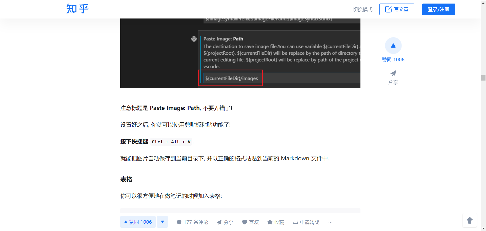

# 123
## 123
### 123
**重点加粗**
*斜体*
~~删除线~~// ~~ ~~
- 123
  - 123
  - 123
- 321
- 213
- 231
1. 列表1
   1. 列表a
   2. 列表b
2. 列表2
>引用 jaskldjaklsjd
```c
  printf("Hello,World~");
```


---
| abc  |  def |  ghi  |
| :--- | ---: | :---: |
| 123  |  123 |  123  |
| >    |  123 |  123  |

自动表格对齐: Shift + Alt + F
- [ ] asdas 
---
 [百度](baidu.com "一个搜索引擎")
 请参考[123](#123)

 ` 123123123`
 <u>123</u>
 :smile:
 H~2~O
 X^2
 ==123==
https://zhuanlan.zhihu.com/p/366596107
选中文本之后, 按下 Ctrl + B 可以给选中文本加粗.
同理 Ctrl + I 可以让选中文本变为斜体.
要进行缩进 (书写嵌套列表), 你可以使用 VS Code 的快捷键 Ctrl + [ 和 Ctrl + ].

单位圆 $x^2+y^2=1$   
公式块:
$$
\begin{cases}
x=\rho\cos\theta \\
y=\rho\sin\theta \\
\end{cases}
$$
上标 $x^2 + y^{12} = 1$
上标 $x_1 + y_{12} = 1$     H~12~O
 较小的行内行分数 $\frac{1}{2}$
展示型的分式 $\displaystyle\frac{x+1}{x-1}$

紧贴 $a\!b$
没有空格 $ab$
小空格 $a\,b$
中等空格 $a\;b$
大空格 $a\ b$
quad 空格 $a\quad b$
两个 quad 空格 $a\qquad b$
累加 $\sum_{k=1}^n\frac{1}{k}  \quad  \displaystyle\sum_{k=1}^n\frac{1}{k}$
累乘 $\prod_{k=1}^n\frac{1}{k}  \quad  \displaystyle\prod_{k=1}^n\frac{1}{k}$
积分 $\displaystyle \int_0^1x{\rm d}x  \quad  \iint_{D_{xy}}  \quad  \iiint_{\Omega_{xyz}}$

VS Code 快捷键
原生快捷键
通用操作
Ctrl + C, 复制当前文本
Ctrl + V, 粘贴当前文本
Ctrl + Z, 撤销
Ctrl + Shift + Z, 反撤销
Shift + Alt + F, 整理代码
Ctrl + /, 将当前行注释 / 反注释, 当多行文本被选中时, 将多行文本注释
光标操作
Ctrl + ← 将光标向左移动一个单词
Ctrl + → 将光标向右移动一个单词
Ctrl + Alt + ↑, 向上加入一个光标
Ctrl + Alt + ↓, 向下加入一个光标
Ctrl + Alt + U, 撤销上次光标操作
界面移动
Ctrl + ↑ 向上移动当前界面
Ctrl + → 向下移动当前界面
选中操作
Shift + ← 向左选中 / 反选中一个字符(重要)
Shift + → 向右选中 / 反选中一个字符(重要)
Ctrl + Shift + ← 向左选中 / 反选中一个单词(重要)
Ctrl + Shift + → 向右选中 / 反选中一个单词(重要)
Ctrl + D当前有选中文本时, 将下一个与其相同的文本加入选中 (重要)
文本行操作
Ctrl + C当前无选中文本时, 复制当前行
Shift + Alt + ↑ 向上复制当前行, 当多行文本被选中时, 向上复制多行 (重要)
Shift + Alt + ↓ 向下复制当前行, 当多行文本被选中时, 向下复制多行 (重要)
Alt + ↑ 向上移动当前行, 当多行文本被选中时, 将当前多行文本向上移动 (重要)
Alt + ↓ 向下移动当前行, 当多行文本被选中时, 将当前多行文本向下移动 (重要)
插件增加的快捷键
Markdown 语法
Ctrl + B当前有选中文本时, 将文本加粗
Ctrl + I当前有选中文本时, 将文本变为斜体
Ctrl + M 进入数学公式模式 (加入美元符)
图片粘贴
Ctrl + Alt + V 粘贴剪      贴板图片 (本地)
Ctrl + Alt + V 粘贴剪贴板图片 (图床)
光标操作
Ctrl + Alt + U 将多选光标变为单选
选中操作
Shift + Alt + ← 向左复制当前选中文本 (重要)
Shift + Alt + → 向右复制当前选中文本 (重要)
Alt + ← 向左移动当前选中文本一个字符(重要)
Alt + → 向右移动当前选中文本一个字符(重要)
Ctrl + Alt + ← 向左移动当前选中文本一个单词(重要)
Ctrl + Alt + → 向右移动当前选中文本一个单词(重要)
计算器功能
Ctrl + Shift + Alt + E 计算当前选中表达式, 用等号连接并输出
Ctrl + Shift + Alt + R 计算当前选中表达式, 并替换当前选中表达式
Ctrl + Shift + Alt + D 定义当前选中表达式, 无输出 