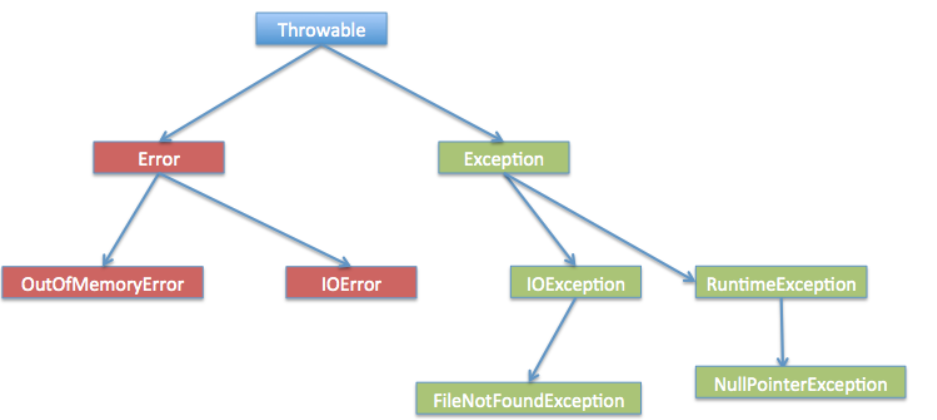
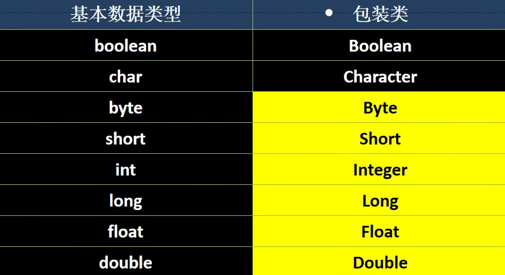

### 文档注释
`javadoc -d 文件地址 -xx -yy Name.java`-xx -yy为javadoc标签
```
/**
 * @author Ctrau
 * @version 1.0
 */
```

```
import java.util.Scanner

Scanner myscanner = new Scanner(System.in);//创建scanner接收数据
String name = myScanner.next();
int age = myScanner.nextInt();
Char key = myScanner.next().charAt(0);
```

IDEA:
复制当前行到下一行Ctrl+d
删除当前行Alt+a
整理格式Ctrl+Alt+L
查看类的继承关系Ctrl+h
定位类的位置Ctrl+b/Ctrl+左键

多态：
编译类型确定以后，运行类型可以变

转型：
向上转型：
```java
class Aminal {
    public void display() {
        System.out.println("Animal");
    }
}
class Cat extends Aminal {
    public void display() {
        System.out.println("Cat");
    }
}
public class Main{
    public static void main(String[] args) {
        Aminal aminal1 = new Aminal();
        Aminal aminal2 = new Cat();
        aminal1.display();
        aminal2.display();
    }
}
```
左边（编译类型） =  右边（运行类型）
>这样做的原因可以让子类对象引用父类对象的方法，若子类中含有display的方法则优先使用子类的方法，若没有，则上上层层查找同名方法,缺点是不能使用子类特有的方法。
属性的调用看编译类型与方法调用相反， 比如子类有a = 20父类有a = 10,向上转型后的object.a = 10(Object object = new subobject(); )

向下转型：
```java
public class Main{
    public static void main(String[] args) {
        //向上转型
        Animal animal = new Dog();
        animal.display();
        //向下转型
        //Animal类中原本没有 eat方法，在向下转型之前如果调用eat方法会报错
        //向下转型为子类Dog类后，就可以调用子类中特有的方法，而不会报错
        animal = (Dog)animal;
        ((Dog) animal).eat();
    }
```
>缺点是不安全，转换失败会报错，Java中为了提高向下转型的安全性，引入了instanceOf  (a instanceOf A == ture)//判断标准是运行类型 ,如果表达式为 true，则可以安全转换

---

> A a = new B();//B extends A    调用a的方法时，方法会与B(运行类型)绑定，同样遵循继承的规则，当在A中找到对应方法时也先看里面是否有B的原方法。值得注意的是，对象属性不具备绑定属性，在A找到对应方法时直接用A的属性即可                                       


**codeblock**:
```java
static{

};//在类加载时会被执行

{

};//对象实例化时会被隐式调用

/*SAME OBJECT/CLASS:static codeblock/method and static value are in the same priority,depending on their sequence ----- non-static type is same
constructor is called lastly*/

class A{
    public A(){
        super();
        //call the normal codeblock
        //other code
    }
}
```
if C extends B extends A
Priority:
1. parrent class static codeblock and static property attributes initialization
2. child class static codeblock and static property attributes initialization
3. parrent class normal codeblock and normal property attributes initialization(because this step is in the super() which functions in the child class's constructor)
4. parrent class constructor
5. child class normal codeblock and normal property attributes 
6. child class method

actually,normal codeblock is in the rear of super and prior to other code(function in constructor)

(loading period) dad's static --> son's static --> 
(instantiation period)son's consructor{super()->son's normal code block -> other code} -->
a. super()-->until object->dad's normal codeblock->dad's other code-->
b. son's normal code block
c. son's other code

**Final**:
```java
final class A{

}//then A can't be extends-ed

class B{
    public final void hi(){

    } 
}
class C extends B{
    @override
    public void hi()//this is wrong cuz final method can't be overrided
}

final int n1 = 24;//then n1 can't be modified

/*
final n1 should be asigned a value(when defined or in the constructor/codeblock)
if it is static final n1, n1 should be assigned a value when defined or in the static codeblock
*/

/*
final-static combo optimize the process of calling a costant(the class will not be loaded so the static codeblock will not function)
*/
```
---

**Abstract**:
```java
abstract class Animal{

    public abstract void eat();//the abstract method must be implenmented by child class(if there is a child class)
} 

```
> abstract class can't be instantiated
> abstract method can't modified by private/final/static

System.currentTimeMillis()//获取当前时间,返回类型为long

**interface**:
```java
interface usb{
    public void work();//omit abstract
    public void stop();
    default public void(){
        
    }
    public static void hello(){

    }
}

interface lighing extends usb{

}

class phone implements usb{
    @override
    public void work(){

    }
    @override 
    public void stop(){

    }
}
```
>all the method in the interface is public/abstract,"abstract" can be omitted
Property attributes in interface is modified as "public static final"
---
**inner class**
```java
public class TEST {
    public static void main(String[] args) {
        outer outer00 = new outer();
        outer01 outer01 = new outer01();
        outer00.m1();
        outer01.method();
    }
}

class outer{
    private int n1 = 100;
    private void m2(){

    }
    public void m1(){
        class inner01{
            private int n1 = 800;
            public void f1(){ //可以用final修饰，还可以有其他的内部类继承
                System.out.println("n1 = " + n1);//遵循就近原则，这里输出800
                System.out.println("outer n1 = " + outer.this.n1);//输出100   outer.this指调用该方法(m1)的对象
                m2();
            }//局部内部类:可以直接调用外部类的所有成员.相当于局部变量（类）
        }
        inner01 inner01 = new inner01();
        inner01.f1();

    }
}

//anonymous inner class:
class outer01{
    private int n1 = 10;
    public void method(){
        A a = new A(){//接口的匿名内部类
            @Override
            public void cry(){
                System.out.println("cry() for a which implements the interface A");
            }
        };
        a.cry();

        ABC abc = new ABC("Kobe"){
            @Override
            void print() {
                System.out.println("abc's print()");
            }
        };//abc运行类型:outer01$2
        abc.print();
    }

    interface A{
        public void cry();
    }
}

class ABC{
    public String name;
    public ABC(String name) {
        this.name = name;
    }

    void print(){
        System.out.println("ABC's print()");
    }
}

```

```java
    //static inner class
public class main{
    public static void main(String[] args){
        outer.inner abc = new outer.inner();//在外部其他类访问内部类方法.1
        abc.123();
        
        outer.inner ABC = outer.getinner();
        ABC.123();//方法.2
    }
}
    class outer{

        static class inner{
            public void 123();{
                System.out.println("123");
            }
        }//can visit static property and method in class outer,but not the non-static one.
    

    public void m1(){
        inner inner1 = new inner();
        inner1.123();
    }
    public static inner getinner(){
        return new inner();
    }
}
```

**enumeration**
```java
    enum season{//enum extends Enum
        SPRING("srping","warm"),WINTER("winter","cold");//should be listed in first line.
        private String name;
        private String desc;

        private season(String name,String decs){
            this.name = name;
            this.desc = desc;
        }
    }
```
``` methods for Enum:
1. name():get the name
2. ordinal():get the k.th(0<= n <= n-1)
3. values(): get a array including every obj in enum
4. valueOf():let String "XXX" --> enum_obj(XXX must in the enum)
5. compareTo():compare two enum_obj with thier ordinal() // return a.ordinal() - b.ordinal()
```
---

**Annotation**

```
@Override --> public @interface Oberride{}//注解类
@Deprecaoted  //修饰class，表示该类已经过时了
@SuppressWarnings//抑制警告信息//@SuppressWarnings{"all"}
@Target//元注释
```
exception:

```java
try{
    
}catch(Exception e){
//if no exception,skip 
}finally{
//always run
}
``` 

---

Wrapper：


---
String:
implement (Serializable可串行化 / Comparable / CharSequence)
使用Unicode字符编码，一个字符占两个字节
该类被final修饰，不能被继承
有属性private final char value[ ] //value可以修改值，但不能修改该地址


---

## Graphic user interface(GUI)
why: to design a useable and nice interface frame for user
https://blog.csdn.net/xiaoxianer321/article/details/120407071
