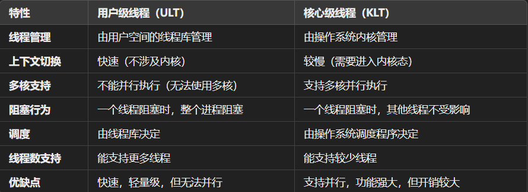
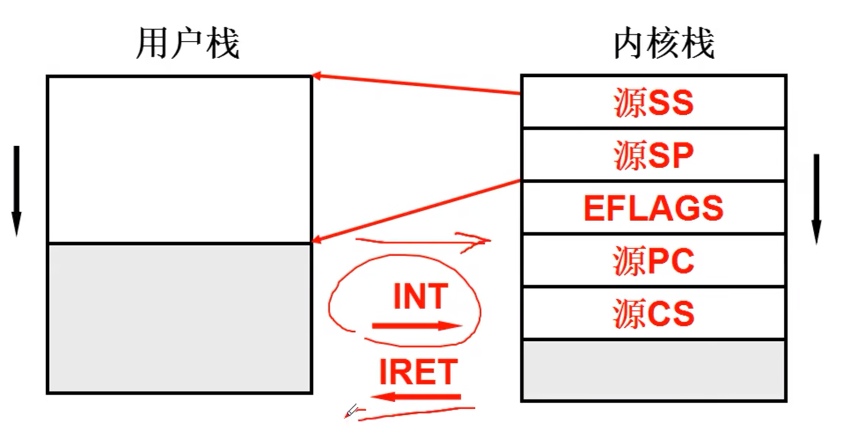
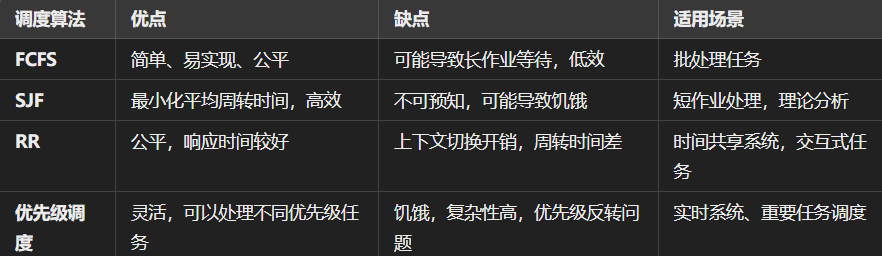

# CPU:
pc(cs:ip)++ -> IR(instruction register)
```
The program counter is crucial because it allows the central processing unit (CPU) to fetch instructions from memory in a sequential manner. 
By keeping track of the current instruction's address, the program counter ensures that the CPU knows which instruction to fetch next.
```

```
The instruction register (IR) is used to store the instruction word. When the CPU fetches an instruction from memory, it is temporarily stored in the IR.
 The instruction is a binary word or code that defines a specific operation to be performed. The instruction word is also called the op code or operation code.
```

**PCB**:
>>https://www.geeksforgeeks.org/process-table-and-process-control-block-pcb/
**TCB**:
用于查找不同线程之间切换栈的位置

进程状态图: PCB+状态+队列
```
进程与线程:
什么是进程？
进程是程序实行的实例，是操作系统分配资源的基本单位，每个进程都有自己的独立空间/数据/资源/代码

什么是线程？
线程是进程中的一个执行单位，是CPU调度的基本单位。线程与在同一进程中的线程共享空间，但每个线程有自己的栈空间和寄存器//避免出现在不同线程之间切换的问题(多个栈)。保留了并发的优点，避免了进程之间的切换代价


  
```

```
用户级线程（User-level Threads，ULT）:
Yield()//多个用户栈
只需要在用户态进行切换,不需要进入内核态访问操作系统

缺点：
不能利用多核：操作系统内核不知道用户级线程的存在，所有线程都在单一的进程内调度，因此用户级线程不能真正并行运行在多核处理器上。
阻塞问题：如果一个用户级线程进行系统调用（例如 I/O 操作），整个进程会被阻塞，因为内核只能看到一个进程，进程中的所有线程都会一起阻塞。
缺乏内核支持的功能：用户级线程无法直接利用操作系统的调度和管理功能，如多核并行性和内核级同步机制（如信号量、事件等）。

线程创建与管理：线程的创建、调度、同步等操作都由**线程库**（如 pthread）完成，内核不参与其中。
线程调度：线程库负责调度线程，操作系统内核并不参与，因此调度开销较小。
上下文切换：由于用户级线程由线程库管理，线程的上下文切换不涉及内核，因此上下文切换的代价较低。
```


```
核心级线程（Kernel-level Threads，KLT）:
线程创建与管理：线程的创建、调度等由操作系统内核负责。
线程调度：内核有完整的调度策略和算法，能有效地进行线程调度，可以为每个线程分配 CPU 时间片。

缺点:
上下文切换：每次线程切换时，都需要进行内核态切换，因此上下文切换的代价较高。
开销较大：由于线程管理和调度由内核负责，每次线程的创建、销毁和上下文切换都需要涉及到内核，因此开销较大。
创建和销毁线程较慢：内核管理线程的创建、销毁过程需要较多的资源和时间。
系统资源消耗较多：每个线程都由内核单独维护一个线程控制块（TCB），因此内核的资源消耗较大。
```



进入内核栈的方法: ==》 中断指令(内/外)


##### 用户态和核心态是如何切换配合工作的：
```
用户态和核心态（也叫内核态）的切换是通过上下文切换机制实现的

用户态和核心态之间的切换通常由以下几个原因触发：
系统调用：当用户程序需要操作系统提供的服务时（如文件操作、内存分配、I/O操作等），它会通过系统调用进入核心态。操作系统会通过系统调用接口处理请求，之后再切换回用户态。
中断：当外部设备（如定时器、键盘、网络等）发生中断时，CPU会暂停当前执行的用户程序，进入核心态，由操作系统中断处理程序来处理中断事件，之后再恢复到用户态。
异常：在程序执行过程中，出现了异常（如非法指令、内存访问错误等），CPU会进入核心态，由操作系统来处理异常，通常会进行错误处理或者终止程序。
进程调度：当操作系统的调度程序决定暂停当前执行的进程，切换到另一个进程时，会涉及到上下文切换。操作系统会保存当前进程的状态（如寄存器内容等），并加载新进程的状态，这一过程会进入核心态进行调度和切换。

-->     从用户态到核心态：
用户程序执行到需要操作系统服务的地方（如执行系统调用），CPU通过中断或陷入指令进入核心态。
操作系统的内核代码开始执行，处理相应的系统请求。
<--     从核心态返回用户态：
内核完成对请求的处理后，通过系统调用返回，或者处理完中断后，操作系统会把当前的进程状态（如寄存器等）恢复。
控制权交还给用户程序，CPU切换回用户态继续执行。

上下文保存：当从用户态切换到核心态时，操作系统需要保存当前进程的上下文（如寄存器的值、程序计数器等）到进程的进程控制块（PCB）中。
上下文恢复：当切换回用户态时，操作系统从PCB中恢复上次保存的上下文，CPU重新加载寄存器和程序计数器的值，使程序从之前暂停的地方继续执行。
```

## CPU调度:
define:CPU调度是操作系统中管理和分配CPU时间给不同进程或线程的过程
基本步骤:
选择：操作系统选择哪个进程或线程可以获得CPU时间。
分配：将CPU的控制权分配给选定的进程或线程。
切换：如果需要调度一个新的进程或线程，操作系统必须保存当前进程或线程的状态（如程序计数器、寄存器等），并加载新进程或线程的状态。

```
I/O-bound进程 vs CPU-bound进程:
    I/O-bound进程主要受限于输入/输出（I/O）操作的速度，而不是处理器的计算能力
    CPU-bound进程是受限于CPU处理能力的进程。它的性能瓶颈在于处理器的计算能力，而不是I/O操作的速度。
    trade off between IO(需要切换线程) and CPU(需要在CPU中花时间处理)
```


##### 调度算法:
- FCFS(First Come First Served)
- SJF(Shortest Job First) 
- RR(Round Robin)//按时间片来轮转调度
- Priority
   - 会出现饿死



---

>平均周转时间（Average Turnaround Time）:
>响应时间（Response Time）: 响应时间=第一次获得CPU的时刻−进程到达时间
>时间片（Time Slice）:时间片是指在轮转调度算法中，每个进程在CPU上运行的最大时间长度


---
schedule():
```c
void schedule(){
    struct task_struct *p,*next;

    for(p = &task[0]; p < &task[NR_TASKS];p++){
        if(p->state == TASK_RUNNING){
           // 如果进程的时间片消耗完了
            if (p->counter <= 0) {
                p->state = TASK_WAITING;  // 将进程挂起
            } else {
                p->counter--;  // 消耗时间片
                break;  // 找到一个可以执行的进程，退出调度
            }
        }
    }
    if(next != current){
        next->state = TASK_RUNNING;
        current->state = TASK_RUNNING;
        switch_to(next);
    }

    //     TASK_RUNNING：表示进程正在执行或者可以立即执行
    // TASK_INTERRUPTIBLE / TASK_UNINTERRUPTIBLE：表示进程正在等待某些事件（如 I/O），不能执行，通常会被挂起
    // TASK_ZOMBIE：表示进程已经结束，但父进程还没有回收它
    //分配的时间片取决于task_struct->priority
}
```
```c
void schedule(void) {
    int i, c;
    struct task_struct **p; // 指向 task_struct 的指针

    /* 初始化最大优先级的任务索引和计数器 */
    c = -1;              // 用于记录当前最大的 counter 值
    next = 0;            // 用于记录下一个需要调度的任务索引
    i = NR_TASKS;        // 总的任务数量
    p = &task[NR_TASKS]; // 指针指向 task[] 数组的末尾

    // 遍历所有任务，找出 TASK_RUNNING 且 counter 最大的任务
    while (--i) {
        p--; // 指向当前的任务
        if ((*p)->state == TASK_RUNNING && (*p)->counter > c) { // 判断任务是否可运行，且 counter 是否更大
            c = (*p)->counter; // 更新最大 counter 值
            next = i;          // 更新下一个任务的索引
        }
    }

    // 如果没有找到合适的任务（所有任务 counter = 0 或状态不可运行）
    if (!c) {
        /* 动态调整所有任务的 counter */
        for (p = &LAST_TASK; p > &FIRST_TASK; --p) {
            (*p)->counter = ((*p)->counter >> 1) + (*p)->priority;
            // counter = (原 counter 值 / 2) + 静态优先级
            // 这样可以动态调整优先级，高优先级任务会恢复更多时间片
        }
    }

    /* 切换到选择的任务 */
    switch_to(next); // 调用 switch_to 切换上下文到索引为 next 的任务
}

```

# 内存:


# 磁盘:


# 文件:


